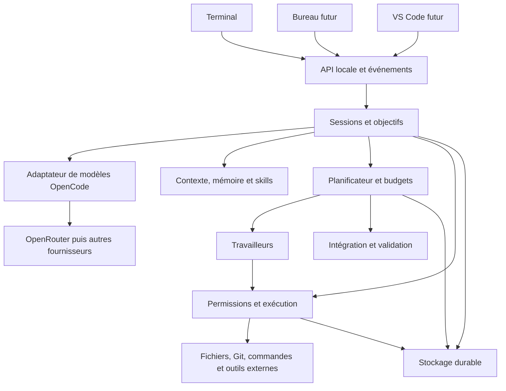

# Architecture cible d’Artemis

Statut : proposition de construction, à confronter au code OpenCode importé.
Les noms et contrats ci-dessous appartiennent à Artemis ; ils ne décrivent pas
des API déjà disponibles dans OpenCode.

## 1. Organisation générale

Un moteur local organisé en modules, avec des processus de travail séparés quand
nécessaire. Le premier démarrage peut être piloté par le terminal ; l’exécution
durable nécessitera ensuite un cycle de vie indépendant de l’interface.



L’API locale reste limitée à la machine par défaut, avec authentification des
clients. Un accès distant et ses permissions constituent une extension distincte.

## 2. Réutilisation et ajouts

| Domaine | Point de départ | Ajout Artemis prévu |
| --- | --- | --- |
| Terminal, sessions, fournisseurs | OpenCode | Affichage des objectifs, budgets et états |
| Outils de code, LSP et MCP | OpenCode, après audit | Périmètres et intégration aux objectifs |
| Permissions | Mécanismes amont | Politique d’autonomie et propagation aux travailleurs |
| Persistance | Sessions amont | Objectifs, tâches, budgets et reprise |
| Skills | Chargement et formats existants | Cycle de création, évaluation et promotion |
| Agents | Sessions et délégation existantes | Planification, isolation et intégration |

Pour chaque capacité, l’audit devra distinguer « existant », « à adapter » et
« à construire ». Une interface de plugin ne sera pas supposée suffisante sans test.

## 3. Modules logiques

```text
packages/artemis/src/          # Emplacement proposé, à confirmer au lot P0
  objectives/                 # Objectifs et critères d’acceptation
  scheduler/                  # Dépendances, planification, limites de concurrence
  workers/                    # Affectations, messages et cycle de vie
  workspaces/                 # Worktrees, références de base et intégration
  policies/                   # Décisions d’autorisation
  memory/                     # Préférences et connaissances récupérables
  learning/                   # Skills candidats, évaluations et versions
  persistence/                # Tables, migrations et journal Artemis
  integration/                # Adaptation aux points d’extension OpenCode
services/documents/           # Optionnel, Python, dans un lot ultérieur
evals/                        # Scénarios et dépôts de référence
```

Ne créer les modules qu’avec leur premier usage. Conserver les packages amont
et éviter une réorganisation globale avant d’avoir une exécution de référence.

## 4. Modèle de données minimal proposé

| Entité | Données essentielles | Propriétaire |
| --- | --- | --- |
| Session | Messages, réponses et résultats d’outils | OpenCode |
| Objectif | Demande, critères, état, budget, référence de session | Artemis |
| Tâche | Objectif, dépendances, périmètre, état, tentative | Artemis |
| Travailleur | Tâche, session, worktree, échéance de possession | Artemis |
| Exécution | Identifiant, action, approbation, état, résultat référencé | Adaptation de l’exécuteur |
| Budget | Limite, réservation, consommation et rapprochement | Artemis |
| Skill | Version, portée, provenance, évaluations et statut | Artemis |

Les grosses sorties restent dans des artefacts référencés. Le journal conserve
les événements utiles, sans enregistrer les secrets ni exiger un raisonnement
interne complet du modèle. Chaque événement porte un identifiant, une séquence,
une date et des identifiants de corrélation.

## 5. Objectifs longs et reprise

États d’objectif proposés : `queued`, `running`, `waiting_approval`, `paused`,
`blocked`, `succeeded`, `failed`, `cancelled`. Les transitions sont validées par le
moteur. La limite de budget provoque une pause explicite ; une tâche terminée ne
reprend pas automatiquement après redémarrage.

Avant une action : enregistrer son intention et son autorisation. Après l’action :
enregistrer le résultat et l’avancement. Une exécution interrompue reste incertaine
tant que son effet n’a pas été vérifié ; ne pas rejouer aveuglément une publication
ou une autre action ayant des effets externes.

Le planificateur utilise une possession temporaire des tâches et une transition
atomique pour éviter deux prises en charge concurrentes. Il récupère une tâche
abandonnée après vérification de l’ancien processus et de ses effets.

La réduction du contexte conserve l’objectif, les contraintes, les décisions,
les références de fichiers, les échecs utiles et le travail restant. Conserver les
messages sources pour retrouver un détail omis ; ne pas dépendre uniquement d’un résumé.

Une politique bornée détecte répétitions, absence de progrès et outils en échec.
Elle choisit une nouvelle tentative, une autre stratégie autorisée ou un état bloqué.

## 6. Édition et exécution

- Lecture avant modification ; précondition de version ou de contenu au moment d’écrire.
- Diff ciblé ; écriture atomique lorsque possible ; refus des modifications périmées.
- Préservation des changements utilisateur et des fichiers non suivis.
- Validation adaptée : diagnostics, tests pertinents et compilation selon le projet.
- Annulation des processus et de leurs descendants, avec résultat explicite.
- Gestion des chemins, liens symboliques, shells et pseudo-terminaux par plateforme.

Les commandes, scripts de tests et plugins exécutent du code. Leur isolation doit
porter sur le système de fichiers, les processus, le réseau et les secrets. Un
filtre de texte sur une commande ne constitue pas une frontière suffisante.

Les autorisations sont vérifiées avant exécution et restent liées à l’action et
au périmètre approuvés. Un skill, un résultat d’outil ou un fichier de dépôt ne peut
pas augmenter les permissions. Les travailleurs héritent de limites au plus égales
à celles du parent. Le fournisseur de modèle conserve ses clés hors des environnements
de travail lorsque ceux-ci n’en ont pas besoin.

## 7. Parallélisme et intégration

Commencer avec un coordinateur et deux travailleurs. Chacun reçoit une tâche bornée,
des critères, une référence Git de départ et son propre worktree. Sérialiser les
opérations qui modifient les métadonnées Git partagées. L’exécution des outils doit
empêcher un travailleur de sortir de son espace autorisé.

Déclarer les dépendances : les tâches qui exigent un résultat non disponible attendent.
Les ports, bases de tests et dossiers temporaires sont distincts. Les changements
du développeur servent de référence explicite si nécessaires, sans commit forcé
ni nettoyage de son espace de travail.

L’intégrateur récupère les changements dans un espace dédié, détecte les conflits,
assemble puis exécute les validations communes. Un conflit sémantique peut exister
sans conflit Git. Une revue et des tests doivent couvrir ce cas.

Le nombre de travailleurs augmente seulement après mesure du gain de durée et de
la dépense supplémentaire. Les appels d’outils parallèles ne sont pas assimilés
à des agents autonomes.

## 8. Mémoire et apprentissage

Séparer session, projet, préférences personnelles et procédures. Les mémoires privées
ne sont pas partagées automatiquement avec l’équipe. Associer les faits au projet,
à leur source et à une date ; détecter ou retirer les informations devenues invalides.

Cycle d’un skill : expérience vérifiée → candidat → évaluation → activation locale
→ revue pour partage → suivi des résultats. Conserver les versions précédentes,
conditions d’application, contre-exemples et raisons de retrait. Un succès unique
ne prouve pas qu’une procédure se généralise.

Charger uniquement les skills pertinents, puis leurs références au besoin. Commencer
avec Markdown et recherche textuelle SQLite ; évaluer les embeddings ultérieurement.

## 9. Fournisseurs, coûts et documents

Réutiliser l’adaptateur modèle d’OpenCode. Vérifier les capacités requises, gérer les
erreurs transitoires avec attente progressive, respecter les quotas et borner les
tentatives. Conserver le fournisseur et le modèle utilisés dans les rapports.

Avant un appel, réserver une estimation du coût dans le budget commun ; rapprocher
avec l’usage réel au retour. Un coût inconnu ne vaut pas zéro. Les plafonds locaux
réduisent les dépassements sans garantir un montant exact si la facturation distante
ou les appels en cours ne sont pas encore connus.

Documents : extraction textuelle native, OCR si nécessaire, puis vision lorsque
la tâche l’exige. Le module Python communique avec le moteur par un contrat borné
(entrée, pages, texte, positions, erreurs), dont le transport sera décidé dans son lot.
Les poids locaux restent optionnels. Le caractère local de l’extraction ne garantit
pas la confidentialité du texte ensuite envoyé au fournisseur.

## 10. Vérification de l’architecture

Les preuves attendues figurent dans le [plan d’implémentation](implementation-plan.md).
Les invariants prioritaires sont : une seule exécution propriétaire d’une tâche,
aucune permission élargie par le modèle, aucune perte silencieuse d’état, aucun
écrasement de changements utilisateur et aucune réussite déclarée sans vérification.
